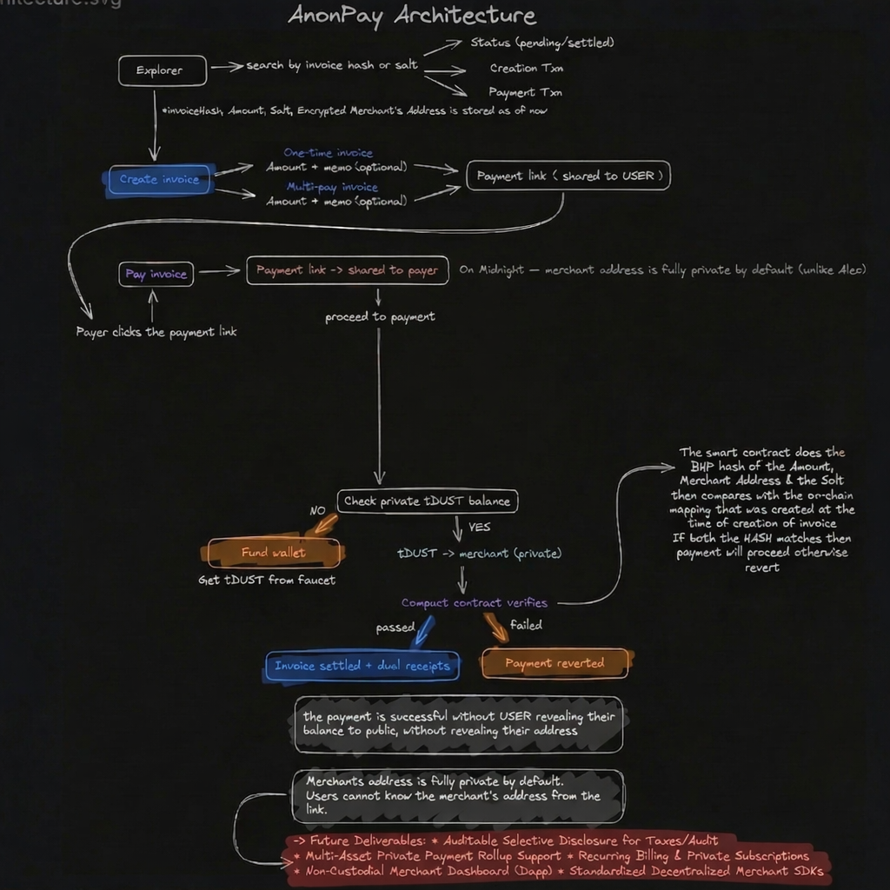

# AnonPay

Private Invoicing and Checkout on Midnight 

AnonPay is a privacy-first invoicing and checkout application built on Midnight. It enables merchants to create invoices, manage payments, run hosted checkout sessions, monitor activity through a dashboard, and generate disclosure links that reveal only selected invoice fields to third parties.

**Built on Midnight Network**

## 🚀 Key Features (MVP)

- **Invoice Creation**: Merchants can create and manage invoices with metadata stored off-chain.
- **Hosted Checkout**: Secure payment sessions with merchant authentication and webhook support.
- **Merchant Dashboard**: Invoice tables, payment history, stats, and profile management.
- **Selective Disclosure**: Application-level disclosure links for settled invoices (reveal amount, settlement date, status).
- **Shielded Payments**: Payment flows tied to Midnight contracts with indexer-driven settlement.
- **Full-Stack MVP**: React frontend, Node.js backend, Midnight Compact contract, Supabase storage.

## 📋 Table of Contents

- [Problem Statement](#problem-statement)
- [Solution Overview](#solution-overview)
- [Why Midnight](#why-midnight)
- [Implemented Features](#implemented-features)
- [Architecture](#architecture)
- [Tech Stack](#tech-stack)
- [Getting Started](#getting-started)
- [Usage](#usage)
- [Deployment](#deployment)
- [Current Limitations](#current-limitations)
- [Future Goals](#future-goals)
- [Contributing](#contributing)
- [License](#license)

## 🛠️ Problem Statement

Crypto payment tooling often falls into two extremes:

- Fully public, exposing payment flows, balances, and business activity.
- Privacy-oriented but hard to integrate into merchant workflows.

Merchants need practical solutions: create invoices without public ledgers, usable dashboards, and selective disclosure for audits/banking.

## 🔄 Solution Overview

AnonPay combines:

- **Midnight Compact Contract**: Invoice state and payment circuits.
- **React Frontend**: Invoice creation, checkout, dashboard, explorer, privacy, docs, developer portal.
- **Node.js Backend**: Merchant onboarding, APIs, checkout sessions, webhooks, disclosure records, Supabase persistence.
- **Split Deployment**: Vercel (frontend), Render/Railway (backend), Supabase (database).

Privacy via Midnight contracts, invoice hashes/commitments, and off-chain data separation. Selective disclosure as backend-controlled records (not yet full ZK proofs).

## 🌙 Why Midnight

Midnight supports privacy-oriented contracts and proofs naturally.

**Current Use**:
- Compact contracts for invoice state.
- Payment circuits and settlement.
- Foundation for shielded/selective-disclosure workflows.

**Future Potential**:
- Richer selective disclosure.
- Stronger contract-layer privacy.
- Less reliance on app-side handling.

## ✅ Implemented Features

### Invoice Creation
- UI for creating invoices.
- Off-chain metadata storage (expiry, amount, memo, type).
- Invoice hash handling and contract integration.

### Payment Flow
- Hosted payment pages.
- `pay_invoice` circuit execution.
- Backend settlement updates via APIs/indexer.
- Invoice status tracking.

### Merchant Dashboard & Profile
- Invoice tables and paid views.
- Stats cards, receipts, history modals.
- Profile QR, wallet balance, burner wallet UI.

### Hosted Checkout
- Merchant registration with secret keys.
- Authenticated session creation/retrieval.
- Settlement updates and redirect URLs.

### Webhooks
- Webhook URL capture and HMAC-SHA256 signing.
- Dispatch on settlement events.
- Auto-sync of payment intent state.

### Disclosure Links
- Generate links for settled invoices.
- Reveal: amount, settlement date, status, recipient description.
- Public verification endpoint by `proof_id`.
- *Note*: Application-level flow (Supabase + backend), not full on-chain ZK verifier yet.

### Supporting Surfaces
- Explorer, Privacy, Docs, Developer Portal pages.
- Merchant onboarding and assistant endpoints.

## 🏗️ Architecture



### Frontend (React 18, TypeScript, Vite, Tailwind)
- Home, Create Invoice, Pay, Profile, Checkout, Explorer, Privacy, Docs, Developer, Invoice Details.

### Backend (Node.js, Express, Supabase)
- Merchant registration/stats.
- Invoice CRUD, verification.
- Checkout sessions, profiles.
- Disclosure creation/lookup.
- Relayer/proof endpoints, webhook dispatch, indexer polling.

### Smart Contract (Midnight Compact, Nightforge)
- Stores: `invoice_hash`, `expiry`, `amount`, `status`, `payer_commitment`.
- Circuits: `create_invoice`, `pay_invoice`, `generate_disclosure_proof`, `get_invoice_status`.
- Features: Invoice lifecycle, nullifier replay protection, amount-aware payments.

### Data Storage (Supabase)
- Invoices, merchants, payment intents, profiles, disclosures.

## 🛠️ Tech Stack

- **Frontend**: React 18, TypeScript, Vite, Tailwind CSS, Framer Motion
- **Backend**: Node.js, Express, Supabase
- **Smart Contracts**: Midnight Compact, Nightforge
- **Database**: Supabase (PostgreSQL)
- **Deployment**: Vercel (frontend), Render/Railway/Fly.io (backend)

## 🚀 Getting Started

### Prerequisites
- Node.js 20+
- npm
- Supabase project
- Midnight toolchain (optional for local contract work)

### Installation
```bash
git clone https://github.com/your-repo/anonpay.git
cd anonpay
npm install
```

### Environment Setup
- Copy `.env.example` → `.env`
- Copy `backend/.env.example` → `backend/.env`
- Copy `frontend/.env.example` → `frontend/.env`
- Configure Supabase, Midnight credentials.

### Running Locally
1. Backend: `npm run start --prefix backend` (port 4000)
2. Frontend: `npm run dev --workspace=anonpay-frontend` (port 5173)
3. Contracts: `npm run compile`, `npm run proof-server`

## 📖 Usage

- **Create Invoice**: Use dashboard to create invoices.
- **Process Payments**: Share hosted checkout URLs.
- **Monitor**: View invoices, stats, history.
- **Disclose**: Generate selective disclosure links.

### Useful Commands
- Build frontend: `npm run build --workspace=anonpay-frontend`
- Build all: `npm run build`
- Deploy contracts: `npm run deploy`

## 🚀 Deployment

- **Frontend**: Vercel or static host.
- **Backend**: Render, Railway, Fly.io, VPS.
- **Database**: Supabase.

Files: `frontend/vercel.json`, `backend/vercel.json`, `render.yaml`, `deployment.json`.

**Current Deployment (Preprod)**:
- Network: `preprod`
- Contract: `3da1d5acee80df7d796747a1c9e14aa9b384b77c15a3e11e2802a8cc65f84bf1`
- Deployed: 2026-04-08T18:25:12.941Z

## ⚠️ Current Limitations

- Selective disclosure is application-level (Supabase/backend), not full end-to-end ZK proofs/verifier UX.
- No arbitrary-field disclosure enforced by contract.
- Contract stores amount/expiry (not just hash).
- No standalone SDK/CLI/MCP packages yet.
- Off-chain metadata not fully encrypted with key management.
- Verifier experience not production-grade.

These are roadmap items, not MVP failures.

## 🔮 Future Goals

- **Stronger Selective Disclosure**: End-to-end ZK proofs, richer fields, recipient-bound semantics, multi-invoice disclosures.
- **Enhanced Privacy**: Encrypted metadata, stronger identity separation, contract-enforced privacy.
- **Contract Expansion**: Richer types, broader circuits, receipt modeling.
- **Developer Ecosystem**: Node SDK, CLI, MCP server, integration guides.
- **Product Expansion**: Mobile polish, multi-token, recurring invoices, accounting integrations, analytics.

---

**AnonPay**: Pay Privately. Reveal Carefully. | [Whitepaper](WHITEPAPER.md)
